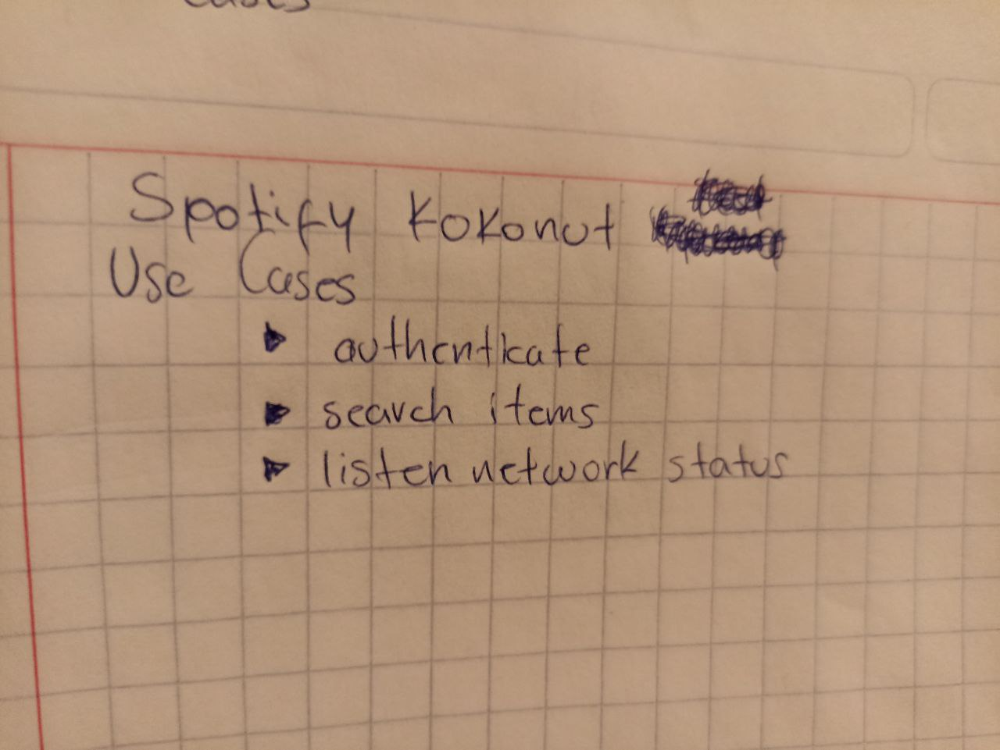
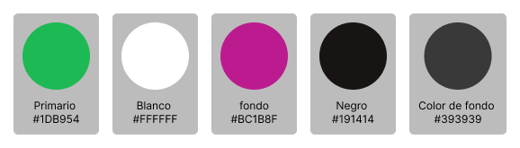

# SpotifyKokonut

## Tabla de contenido
-   [Casos de uso](#casos-de-uso)
    -   [Autenticarse](#autenticarse)
    -   [Buscar elementos](#buscar-elementos)
    -   [Escuchar status del Internet](#escuchar-status-del-internet)
-   [Acerca de el UI/UX](#acerca-de-el-ui/ux)
    -   [Colores](#colores)
    -   [Consideraciones](#consideraciones)
-   [Feedback](#feedback)
-   [Información de Angular](#información-de-angular).
    -   [Ingresar](#ingresar)
    -   [Ver mi perfil](#ver-mi-perfil)

# Casos de uso
De acuerdo con los objetivos presentados en el documento de la prueba técnica se obtuvieron los siguientes `casos de uso`.

## Autenticarse
**Objetivo :** Permitir a los usuarios iniciar sesión. Mientras que si un usuario no tenga una cuenta permitir la opción de crear una.

**Actor :**  Usuario.

**Responsable :** Jose Carlos Huerta Garcia

## Buscar elementos
**Objetivo :** Permitir al cliente iniciar una búsqueda a través de una palabra clave `(keyword)`.

**Actor :**  Usuario.

**Responsable :** Jose Carlos Huerta Garcia
## Escuchar status del Internet

**Objetivo :** Dar al usuario información acerca del estatus de su conexión de internet.

**Actor :**  Usuario.

**Responsable :** Jose Carlos Huerta Garcia

## Acerca de el UI/UX
Para algún comentario o recomendación, por favor manda mensaje a este correo [carlosj12336@gmail.com](carlosj12336@gmail.com)

### Colores
Se utilizaron los colores principales de Spotify agregando un gris & morado para agregar mas contraste. [colores de Spotify](https://developer.spotify.com/documentation/general/design-and-branding/#using-our-colors)

### Consideraciones
**Tamaño pantalla :** se opto un una medida común de 1920×1080px

**Tamaño pantalla :** se opto un una medida común de 1920×1080px

**Tamaño pantalla :** se opto un una medida común de 1920×1080px

## Feedback

Para algún comentario o recomendación, por favor manda mensaje a este correo [carlosj12336@gmail.com](carlosj12336@gmail.com)

# Información de Angular

This project was generated with [Angular CLI](https://github.com/angular/angular-cli) version 15.2.2.

## Development server

Run `ng serve` for a dev server. Navigate to `http://localhost:4200/`. The application will automatically reload if you change any of the source files.

## Code scaffolding

Run `ng generate component component-name` to generate a new component. You can also use `ng generate directive|pipe|service|class|guard|interface|enum|module`.

## Build

Run `ng build` to build the project. The build artifacts will be stored in the `dist/` directory.

## Running unit tests

Run `ng test` to execute the unit tests via [Karma](https://karma-runner.github.io).

## Running end-to-end tests

Run `ng e2e` to execute the end-to-end tests via a platform of your choice. To use this command, you need to first add a package that implements end-to-end testing capabilities.

## Further help

To get more help on the Angular CLI use `ng help` or go check out the [Angular CLI Overview and Command Reference](https://angular.io/cli) page.
