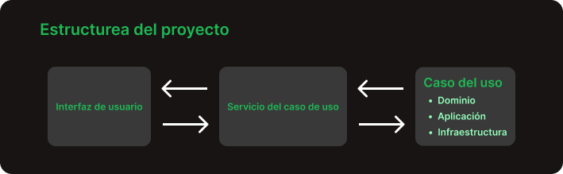
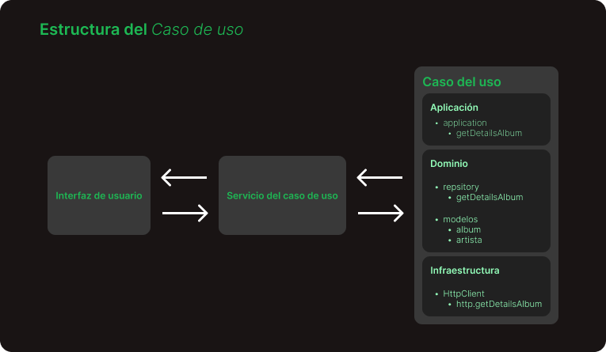

# SpotifyKokonut

El diseño de la aplicación se encuentra en [Figma](https://www.figma.com/file/KmEqRUw6lOtlXqftnSkhvE/Spotify?node-id=19%3A68&t=MaInF3f4ypP9gNXU-0)

## Tabla de contenido
-   [Casos de uso](#casos-de-uso)
    -   [Autenticarse](#autenticarse)
    -   [Buscar elementos](#buscar-elementos)
    -   [Escuchar status del Internet](#escuchar-status-del-internet)
-   [Estructura del proyecto](#estructura-del-proyecto)
    -   [Diagramas](#diagramas)
    -   [Ejemplo getAlbumDetailsByID](#ejemplo-getalbumdetailsbyid)
-   [Acerca de el UI/UX](#acerca-de-el-uiux)
    -   [Diseño](#diseño)
    -   [Colores](#colores)
    -   [Consideraciones](#consideraciones)
-   [Estructura del proyecto en GitHub](#estructura-del-proyecto-en-github)
-   [Herramientas & npm usados](#herramientas-usadas-npm)
-   [Feedback](#feedback)
-   [Información de Angular](#información-de-angular).
    -   [Ingresar](#ingresar)

# Casos de uso
De acuerdo con los objetivos presentados en el documento de la prueba técnica se obtuvieron los siguientes `casos de uso`.

## Autenticarse
- **Objetivo :** Permitir a los usuarios iniciar sesión. Mientras que si un usuario no tenga una cuenta permitir la opción de crear una.
- **Actor :**  Usuario.
- **Responsable :** Jose Carlos Huerta Garcia

## Buscar elementos
- **Objetivo :** Permitir al cliente iniciar una búsqueda a través de una palabra clave `(keyword)`.
- **Actor :**  Usuario.
- **Responsable :** Jose Carlos Huerta Garcia

## Escuchar status del Internet
- **Objetivo :** Dar al usuario información acerca del estatus de su conexión de internet.
- **Actor :**  Usuario.
- **Responsable :** Jose Carlos Huerta Garcia

## Estructura del proyecto

### Diagramas
- Estructura del proyecto

- Estructura de la `interfaz de usuario`

- Estructura de la `Servicio del caso de uso`

- Estructura del `Caso de uso`

### Ejemplo getAlbumDetailsByID

## Acerca de el UI/UX

### Diseño
El planteamiento del diseño de la aplicación se encuentra en Figma, [diseño](https://www.figma.com/file/KmEqRUw6lOtlXqftnSkhvE/Spotify?node-id=19%3A68&t=MaInF3f4ypP9gNXU-0)

### Colores
Se utilizaron los colores principales de Spotify agregando un gris & morado para agregar mas contraste. [colores de Spotify](https://developer.spotify.com/documentation/general/design-and-branding/#using-our-colors)

### Consideraciones
- **Tamaño pantalla :** se opto un una medida común de 1920×1080px

## Estructura del proyecto en GitHub
Estas son las ramas que se crearon para completar la propuesta de la prueba técnica. [Ramas de GitHub](https://github.com/jcarloshg/SpotifyKokonut/branches)

## Herramientas & npm usados
### Harramientas
- **quicktype :** Convertir respuestas JSON to clases de un lenguaje en especifico (en este caso se crearon interfaces) [quicktype](https://quicktype.io/)
- **lottiefiles :** Obtener aminaciones en formato gif. [lottiefiles](https://lottiefiles.com/)

### NPM
- **bootstrap :** Para el diseño de los estilos y responsabilidad. [bootstrap](https://getbootstrap.com/docs/5.0/getting-started/introduction/)
- **ngx-cookie-service :** Para el manejos del almacenamiento de las cookies [ngx-cookie-service](https://www.npmjs.com/package/ngx-cookie-service)
- **ngx-online-status :** para las obtener las suscripción del estado de la conexión a Internet [ngx-online-status](https://www.npmjs.com/package/ngx-online-status)

## Feedback
Para algún comentario o recomendación, por favor manda mensaje a este correo [carlosj12336@gmail.com](carlosj12336@gmail.com)

# Información de Angular

This project was generated with [Angular CLI](https://github.com/angular/angular-cli) version 15.2.2.

## Development server

Run `ng serve` for a dev server. Navigate to `http://localhost:4200/`. The application will automatically reload if you change any of the source files.

## Code scaffolding

Run `ng generate component component-name` to generate a new component. You can also use `ng generate directive|pipe|service|class|guard|interface|enum|module`.

## Build

Run `ng build` to build the project. The build artifacts will be stored in the `dist/` directory.

## Running unit tests

Run `ng test` to execute the unit tests via [Karma](https://karma-runner.github.io).

## Running end-to-end tests

Run `ng e2e` to execute the end-to-end tests via a platform of your choice. To use this command, you need to first add a package that implements end-to-end testing capabilities.

## Further help

To get more help on the Angular CLI use `ng help` or go check out the [Angular CLI Overview and Command Reference](https://angular.io/cli) page.
